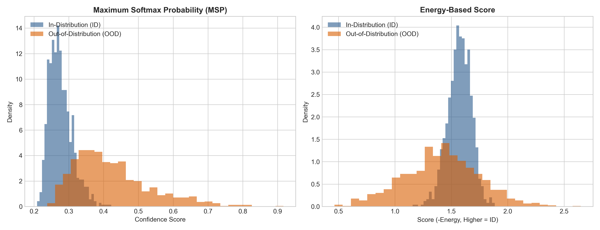
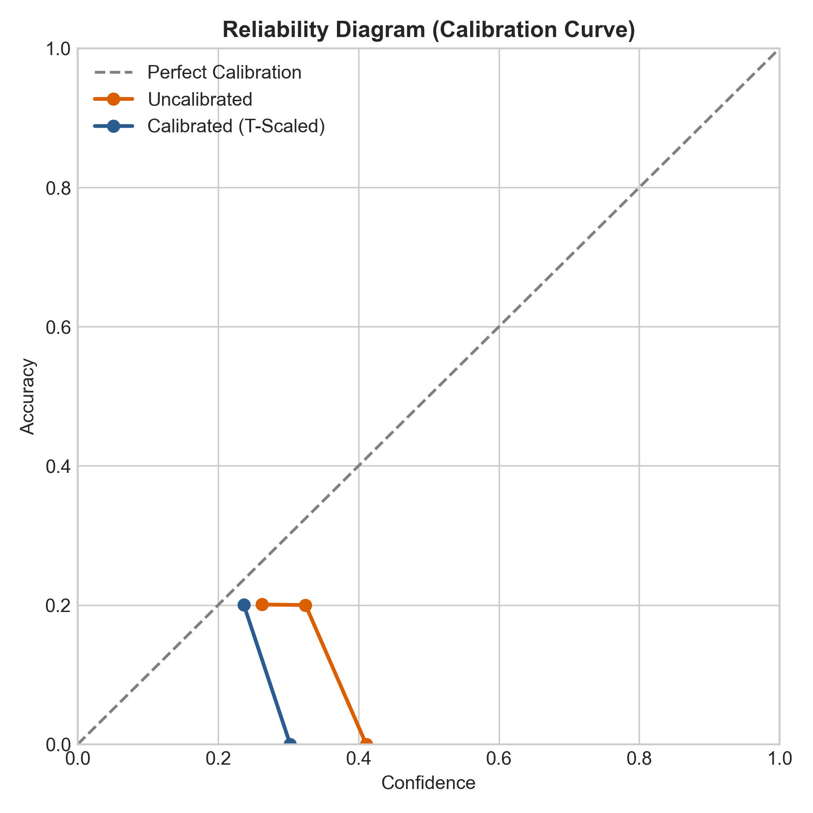
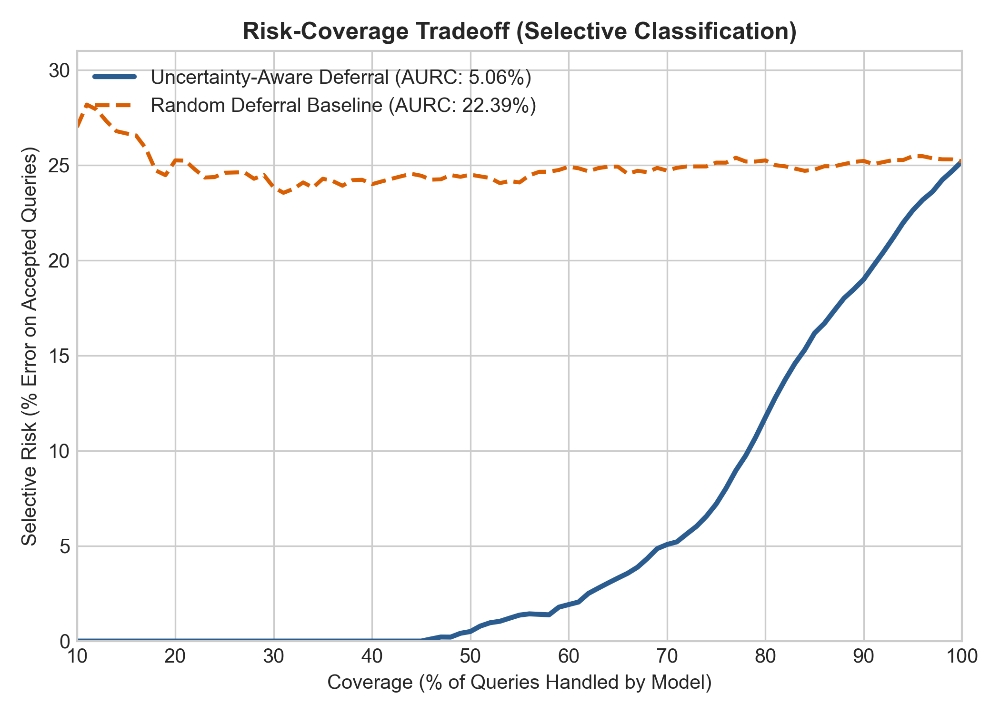

# Uncertainty Quantification & Out-of-Distribution (OOD) Detection

A clean PyTorch implementation evaluating **Model Calibration** (ECE, Temperature Scaling) and **OOD Detection** (MSP vs. Energy-based Scoring).

## Key Highlights
- **Post-Hoc Calibration:** Reduced Expected Calibration Error (ECE) from **7.61% down to 3.67%** via Platt/Temperature Scaling ($T \approx 2.01$).
- **The Softmax Illusion:** Demonstrated empirical failure of Maximum Softmax Probability (MSP, AUROC ~5.5%) under scaled shifted inputs due to softmax saturation.
- **Energy-Based Advantage:** Achieved robust distribution separation (AUROC 68.07%) using an Energy-based score function without requiring retraining.

---

## Visual Benchmarks

### 1. OOD Score Distributions (MSP vs. Energy)

*MSP fails to separate OOD samples due to overconfident probability normalization, whereas Energy preserves relative logit magnitudes.*

### 2. Reliability Diagram (Calibration Curve)

*Temperature scaling aligns model confidence with true accuracy along the diagonal.*

---

## Benchmark Results

| Metric | Baseline (MSP) | Energy-Based Score |
| :--- | :---: | :---: |
| **AUROC** (↑) | 5.49% | **68.07%** |
| **FPR @ 95% TPR** (↓) | 100.00% | **52.60%** |
| **ECE (Pre / Post)** | 7.61% | **3.67%** |

---

## How to Run

1. Clone the repository and install dependencies:
```bash
git clone [https://github.com/](https://github.com/)<your-username>/ood-uncertainty-benchmark.git
cd ood-uncertainty-benchmark
pip install -r requirements.txt
```

2. Uncertainty-Aware Deferral (Selective Classification)

In safety-critical domains, a model must know when to abstain. By utilizing predictive entropy as an uncertainty gating function, the system defers ambiguous cases to a human-in-the-loop:



- **Coverage vs. Risk Tradeoff:** Progressively deferring high-entropy queries allows the model to drop its operational error rate from ~25% down to under 5%.
- **Area Under Risk-Coverage (AURC):** Evaluates how effectively the uncertainty score prioritizes mistakes over correct classifications compared to random deferral.
